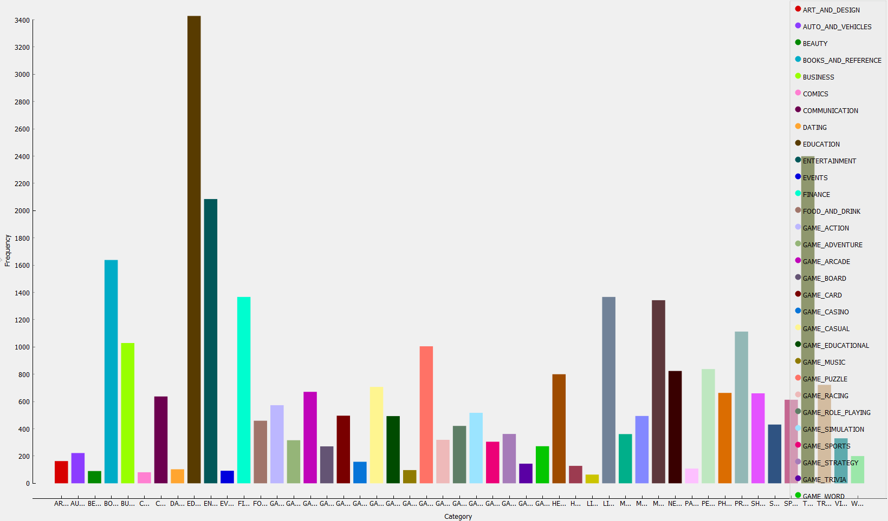

# Projeto Orange / Análise de Dados do Google PlayStore

## Imagem do Projeto

## Arquivo do Projeto

Download do projeto Google Playstore no Orange: [download](orange/google-playstore.ows)

## Gráfico(s) de Análise

Distribuição de categorias entre os apps listados

Apps gratuitos avaliados mais vezes e com as mehores notas

Apps pagos avaliados mais vezes e com as melhores notas

# Projeto Orange / Regras de Associação para Foodmart

## Imagem do Projeto

## Arquivo do Projeto

Download do projeto Foodmart no Orange: [download](orange/foodmart2000-association.ows)

# Projeto de Composição de Componentes para Recomendação

# Projeto de Composição de Componentes para Pedido

## Diagrama de Componentes

## Diagrama de Interfaces
