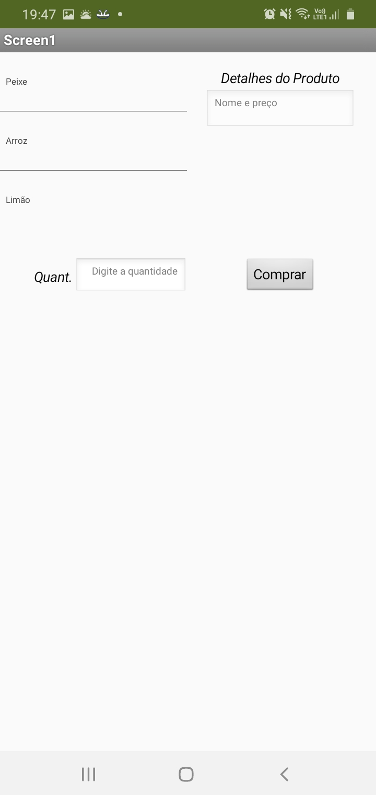
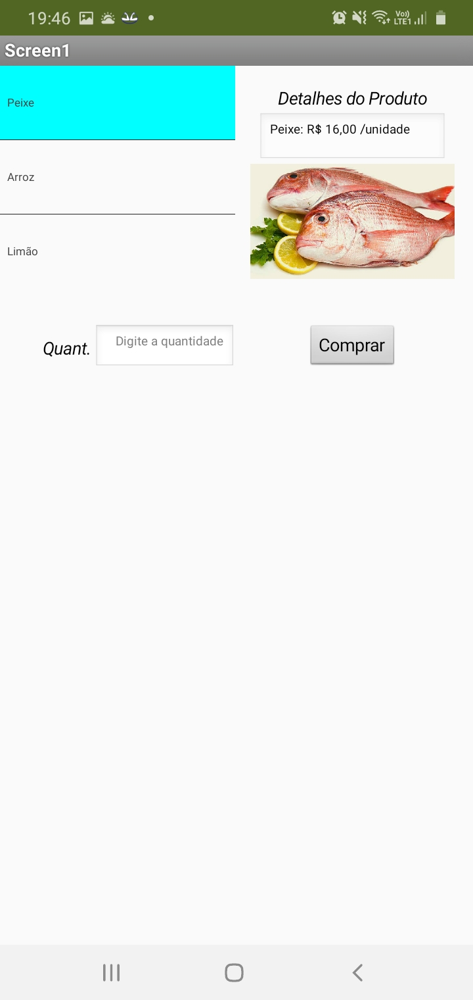
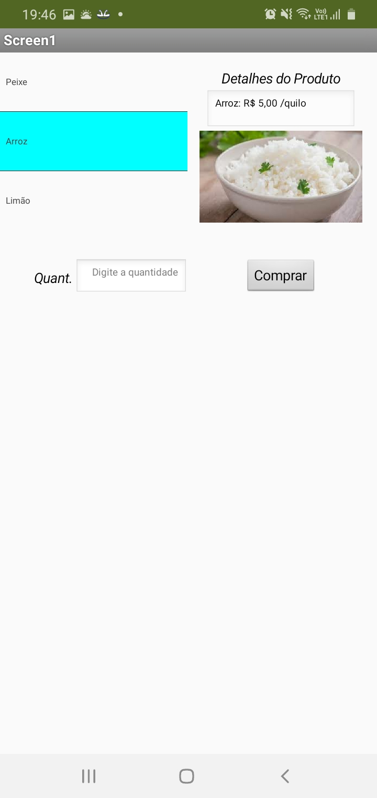
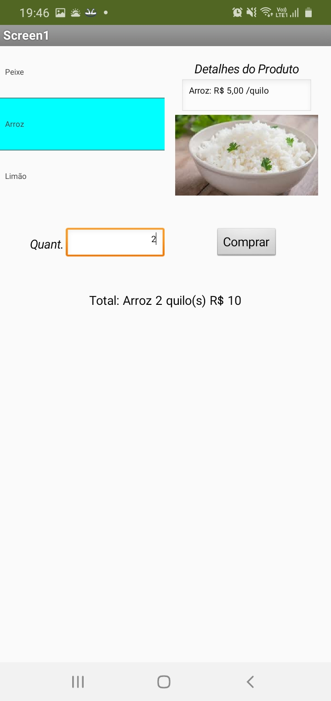
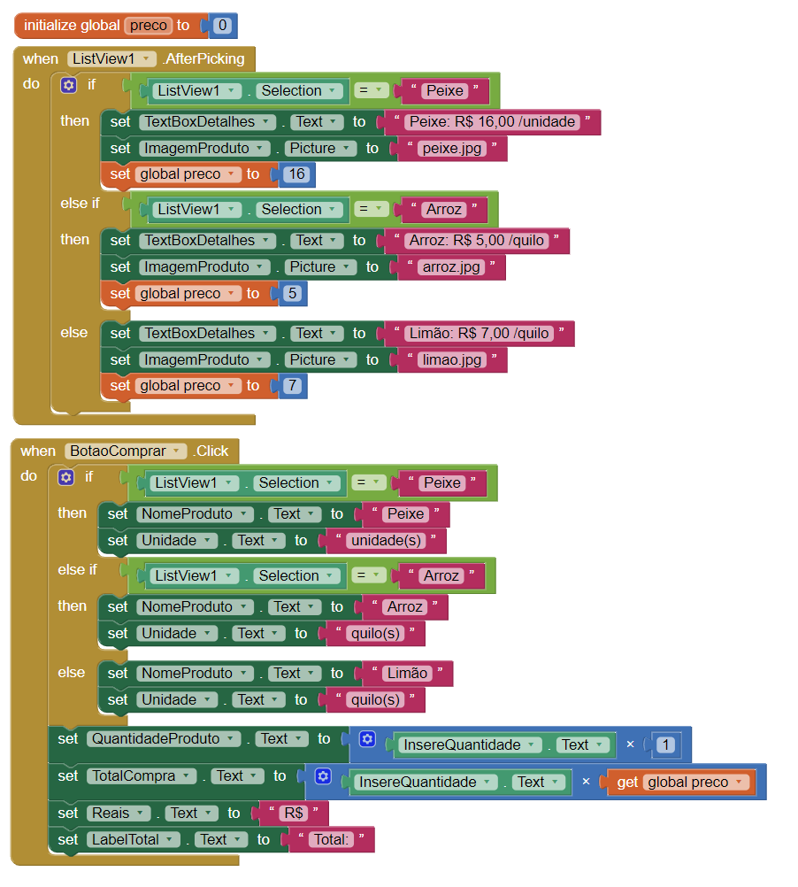

# Tarefa 1

# Tarefa 2

# Tarefa 3

Tela 1 - nenhum produto selecionado

Tela 2 - primeiro produto selecionado

Tela 3 - segundo produto selecionado

Tela 4 - compra de um dos produtos efetiva

Tela 5 - diagrama de blocos do aplicativo

Download do aplicativo exportado a partir do MIT App Inventor em formato .aia: [download](app/inf331_lab3_tarefa3_wilson_costa.aia)
