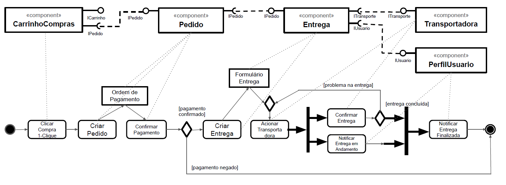
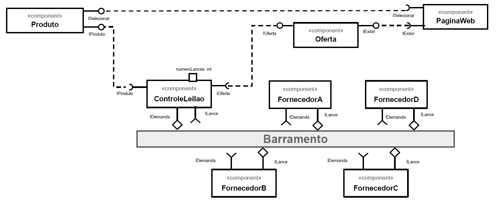

# Tarefa 1

# Tarefa 2

Sequência de interações entre os componentes:

1. O componente ControleLeilao posta uma mensagem, através da interface IDemanda, no tópico leilao/demanda/tipo_produto/produto_x (onde tipo_produto indica a categoria do produto escolhido e produto_x é a identificação do produto no Marketplace).
2. Os componentes do tipo Fornecedor, que assinam o tópico leilao/demanda/tipo_produto, postam uma mensagem com o lance referente àquele produto, através da interface ILance, no tópico leilao/lance/tipo_produto/produto_x. 
3. A mensagem postada deve conter o preço para o produto e um timeStamp que indica a hora em que o lance foi feito.
4. O componente ControleLeilao, que assina o tópico leilao/lance/#, reúne os lances recebidos para o produto especificado.
5. Com base na propriedade numeroLances (nesta tarefa esse valor é igual a 3), o componente ControleLeilao monta uma lista com os melhores lances e cria um objeto do tipo Oferta com os lances escolhidos.
6. Os lances são escolhidos com o critério menor preço. Em caso de empate, é escolhido o lance feito primeiro, com base na propriedade timeStamp incluída na mensagem do lance.

# Tarefa 3

Tela 1 - nenhum produto selecionado:

Tela 2 - primeiro produto selecionado:

Tela 3 - segundo produto selecionado:

Tela 4 - compra de um dos produtos efetivada:

Tela 5 - diagrama de blocos do aplicativo:

Download do aplicativo exportado a partir do MIT App Inventor em formato .aia: [download](app/inf331_lab3_tarefa3_wilson_costa.aia)

# Tarefa 4

Link para entrega da tarefa em grupo: [INF331-equipe4](https://github.com/INF331-equipe4/Labs/tree/master/lab03)
