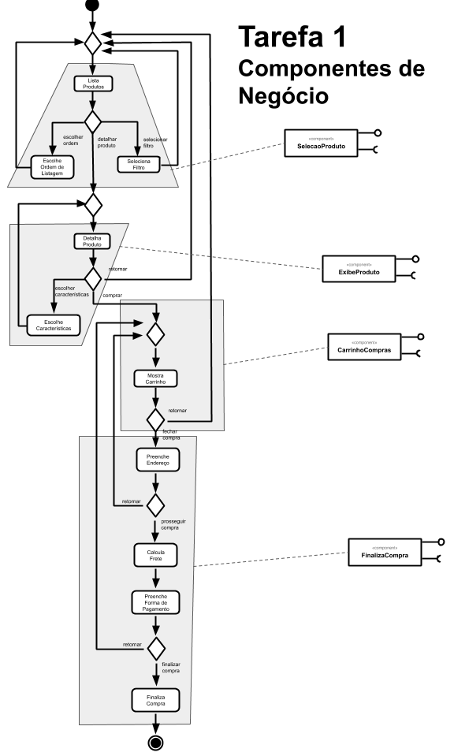
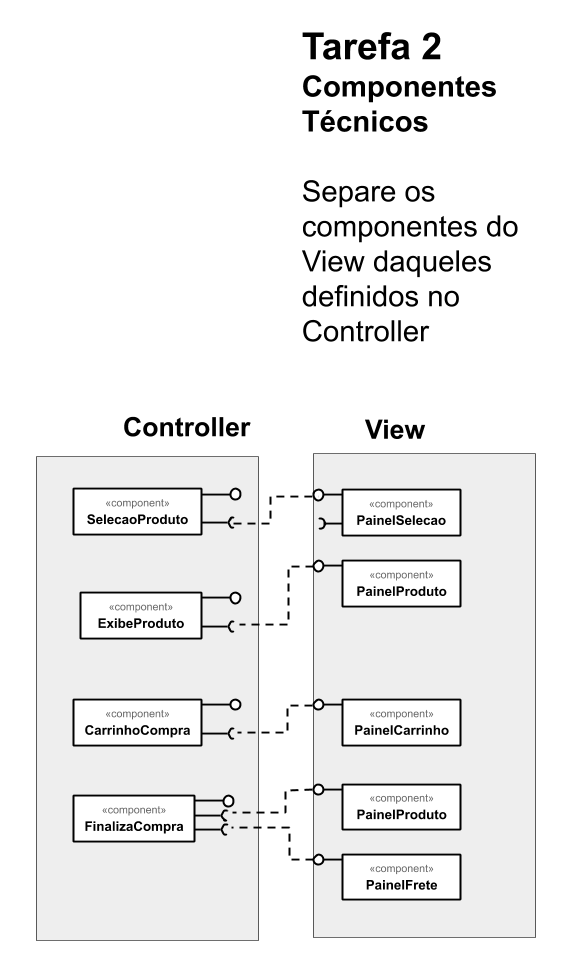
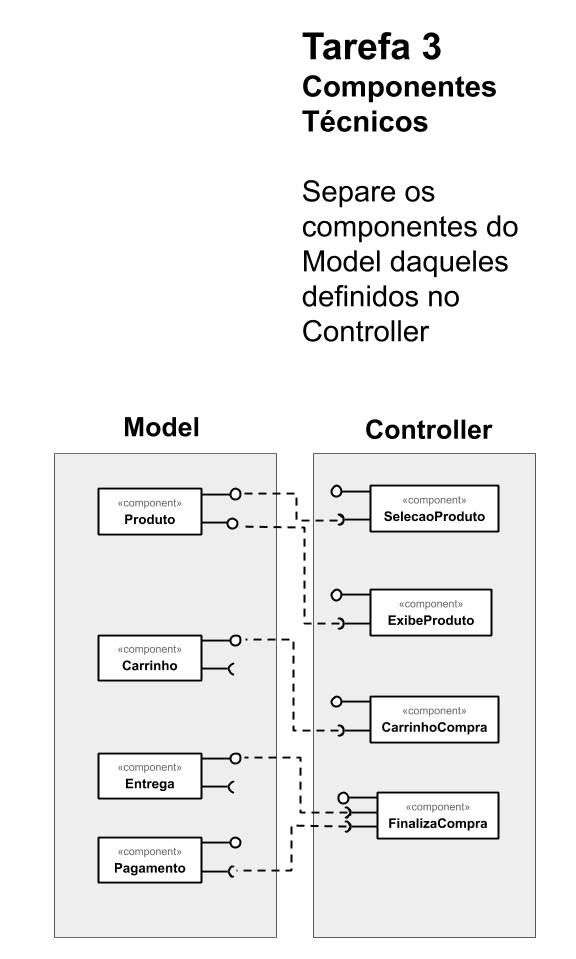

# Tarefa 1

# Tarefa 2

# Tarefa 3

# Tarefa 4

## Serviço `ODWeather`

* **Título do serviço**: `getWeatherDisplay`
* **Breve descrição**:
  > API que retorna dados sobre o clima , em um dado período de tempo, em uma estação geográfica específica. Os dados sobre o clima incluem, por exemplo, temperatura, velocidade e direção do vento, umidade e pressão.
* **URL completa da requisição**: `https://any-api.com:8443/http://api.oceandrivers.com/v1.0/getWeatherDisplay/cnarenal/?period=latestday`
* **Cabeçalho HTTP da chamada**:
~~~http
:authority: any-api.com:8443
:method: GET
:path: /http://api.oceandrivers.com/v1.0/getWeatherDisplay/cnarenal/?period=latestday
:scheme: https
accept: application/json
accept-encoding: gzip, deflate, br
accept-language: pt-BR,pt;q=0.9,en-US;q=0.8,en;q=0.7
origin: https://any-api.com
referer: https://any-api.com/oceandrivers_com/oceandrivers_com/console/ODWeather/getWeatherDisplay
sec-fetch-dest: empty
sec-fetch-mode: cors
sec-fetch-site: same-site
user-agent: Mozilla/5.0 (Windows NT 10.0; Win64; x64) AppleWebKit/537.36 (KHTML, like Gecko) Chrome/84.0.4147.135 Safari/537.36
~~~
* **Cabeçalho HTTP da resposta**:
~~~http
access-control-allow-headers: x-requested-with, Content-Type, origin, authorization, accept, client-security-token
access-control-allow-methods: POST, GET, OPTIONS, DELETE, PUT
access-control-allow-origin: *
access-control-expose-headers: date,server,content-length,access-control-allow-origin,access-control-allow-methods,access-control-max-age,access-control-allow-headers,connection,content-type,x-final-url
access-control-max-age: 1000
cf-cache-status: DYNAMIC
cf-ray: 5c99a1645919f770-GRU
cf-request-id: 04d3e332b70000f770dcbda200000001
content-encoding: br
content-type: application/json
date: Thu, 27 Aug 2020 23:39:12 GMT
expect-ct: max-age=604800, report-uri="https://report-uri.cloudflare.com/cdn-cgi/beacon/expect-ct"
server: cloudflare
set-cookie: __cfduid=d730a097d1759e80a38de3c2cdfe865d41598571551; expires=Sat, 26-Sep-20 23:39:11 GMT; path=/; domain=.any-api.com; HttpOnly; SameSite=Lax
status: 200
x-cors-redirect-1: 301 https://api.oceandrivers.com/v1.0/getWeatherDisplay/cnarenal/?period=latestday
x-final-url: https://api.oceandrivers.com/v1.0/getWeatherDisplay/cnarenal/?period=latestday
x-request-url: http://api.oceandrivers.com/v1.0/getWeatherDisplay/cnarenal/?period=latestday
~~~
* **Conteúdo da resposta**:
~~~json
{
  "TEMPERATURE": {
    "0": 25.3,
    "1": 24.7,
    "2": 23.9,
    "3": 23.8,
    "4": 23.6,
    "5": 23.6,
    "6": 24.2,
    "7": 25.8,
    "8": 27,
    "9": 27.3,
    "10": 27.7,
    "11": 27.8,
    "12": 27.6,
    "13": 27.7,
    "14": 27.7,
    "15": 27.7,
    "16": 27.7,
    "17": 27.6,
    "18": 27.5,
    "19": 27,
    "20": 26.4,
    "21": 24.9,
    "22": 24.8,
    "23": 24.3
  },
  "TWD": {
    "0": 78,
    "1": 97,
    "2": 93,
    "3": 96,
    "4": 43,
    "5": 11,
    "6": 84,
    "7": 348,
    "8": 286,
    "9": 244,
    "10": 244,
    "11": 247,
    "12": 252,
    "13": 236,
    "14": 248,
    "15": 253,
    "16": 250,
    "17": 243,
    "18": 245,
    "19": 183,
    "20": 165,
    "21": 155,
    "22": 149,
    "23": 83
  },
  "TWS": {
    "0": 1,
    "1": 1,
    "2": 1,
    "3": 1,
    "4": 0,
    "5": 1,
    "6": 2,
    "7": 1,
    "8": 4,
    "9": 7,
    "10": 11,
    "11": 13,
    "12": 11,
    "13": 10,
    "14": 11,
    "15": 9,
    "16": 9,
    "17": 7,
    "18": 4,
    "19": 0,
    "20": 1,
    "21": 2,
    "22": 2,
    "23": 3
  },
  "TIMESTAMP": {
    "0": "2:31",
    "1": "3:31",
    "2": "4:31",
    "3": "5:31",
    "4": "6:31",
    "5": "7:31",
    "6": "8:31",
    "7": "9:31",
    "8": "10:31",
    "9": "11:31",
    "10": "12:31",
    "11": "1:31",
    "12": "2:31",
    "13": "3:31",
    "14": "4:31",
    "15": "5:31",
    "16": "6:31",
    "17": "7:31",
    "18": "8:31",
    "20": "10:31",
    "21": "11:31",
    "22": "12:31",
    "23": "1:31"
  },
  "LATEST_DATA": {
    "TWS_GUST_MAX": {
      "TIME_STRING": "28-8-2020 12:04_AM:00",
      "VALUE": "4.3"
    },
    "TWD": 108,
    "HUMIDEX": 33.7,
    "TWS": 3.1,
    "LOCALTIME": 2,
    "HUMIDITY_IN": 100,
    "WINDCHILL": 24.2,
    "TEMP_IN": 56,
    "ICON_NOW": "1",
    "ICON_FOR": "1",
    "TEMPERATURE": 24.2,
    "TWS_GUST": 2.6,
    "RAIN": 0,
    "PRESSURE": 1012.4,
    "LONGITUDE": 2.733,
    "PRESSURE_TR": -0.4,
    "RAIN_MONTH": 0.4,
    "RAIN_DAY": 0,
    "HUMIDITY": 88,
    "TIME_STRING": "28-8-2020 01:35:19",
    "TIME": 1598571319000,
    "LATITUDE": 39.5,
    "WEATHER_DES": "Humid/Night_time"
  },
  "RAIN": {
    "0": 0,
    "1": 0,
    "2": 0,
    "3": 0,
    "4": 0,
    "5": 0,
    "6": 0,
    "7": 0,
    "8": 0,
    "9": 0,
    "10": 0,
    "11": 0,
    "12": 0,
    "13": 0,
    "14": 0,
    "15": 0,
    "16": 0,
    "17": 0,
    "18": 0,
    "19": 0,
    "20": 0,
    "21": 0,
    "22": 0,
    "23": 0
  },
  "HUMIDITY": {
    "0": 85,
    "1": 85,
    "2": 87,
    "3": 88,
    "4": 88,
    "5": 89,
    "6": 88,
    "7": 86,
    "8": 77,
    "9": 82,
    "10": 79,
    "11": 81,
    "12": 84,
    "13": 84,
    "14": 83,
    "15": 83,
    "16": 82,
    "17": 82,
    "18": 82,
    "19": 83,
    "20": 85,
    "21": 85,
    "22": 87,
    "23": 88,
    "24": 88,
    "25": 89,
    "26": 88,
    "27": 86,
    "28": 77,
    "29": 82,
    "30": 79,
    "31": 81,
    "32": 84,
    "33": 84,
    "34": 83,
    "35": 83,
    "36": 82,
    "37": 82,
    "38": 82,
    "39": 83,
    "40": 84,
    "41": 86,
    "42": 87,
    "43": 88
  },
  "PRESSURE": {
    "0": 1017.5,
    "1": 1017.2,
    "2": 1017.1,
    "3": 1016.8,
    "4": 1016.6,
    "5": 1016.9,
    "6": 1016.9,
    "7": 1016.8,
    "8": 1016.9,
    "9": 1017,
    "10": 1016.7,
    "11": 1016.4,
    "12": 1016.1,
    "13": 1015.5,
    "14": 1015,
    "15": 1014.7,
    "16": 1014.2,
    "17": 1013.7,
    "18": 1013.4,
    "19": 1013.4,
    "20": 1013.5,
    "21": 1013.3,
    "22": 1012.9,
    "23": 1012.5
  },
  "length": 24,
  "TIME": {
    "0": 1598488519000,
    "1": 1598492119000,
    "2": 1598495719000,
    "3": 1598499319000,
    "4": 1598502919000,
    "5": 1598506519000,
    "6": 1598510119000,
    "7": 1598513719000,
    "8": 1598517319000,
    "9": 1598520919000,
    "10": 1598524519000,
    "11": 1598528119000,
    "12": 1598531719000,
    "13": 1598535319000,
    "14": 1598538919000,
    "15": 1598542519000,
    "16": 1598546119000,
    "17": 1598549719000,
    "18": 1598553319000,
    "19": 1598556919000,
    "20": 1598560519000,
    "21": 1598564119000,
    "22": 1598567719000,
    "23": 1598571319000
  },
  "ACTIVE": "ON"
}
~~~

### Serviço `College Football Data`

* **Título do serviço**: `getTeamMatchup`
* **Breve descrição**:
  > API que retorna dados sobre jogos entre dois times de futebol americano universitário, ocorridos em um período definido por um ano mínimo e um ano máximo. Entre os dados retornados estão o nome do estádio em que o jogo ocorreu, a data do jogo e a pontuação dos dois times.
* **URL completa da requisição**: `https://any-api.com:8443/https://api.collegefootballdata.com/teams/matchup?team1=Florida%20Atlantic&team2=Florida%20International&minYear=2018&maxYear=2019`
* **Cabeçalho HTTP da chamada**:
~~~http
:authority: any-api.com:8443
:method: GET
:path: /https://api.collegefootballdata.com/teams/matchup?team1=Florida%20Atlantic&team2=Florida%20International&minYear=2018&maxYear=2019
:scheme: https
accept: */*
accept-encoding: gzip, deflate, br
accept-language: pt-BR,pt;q=0.9,en-US;q=0.8,en;q=0.7
if-none-match: W/"27e-BJ4Ul4Ck2gW4PbEz9Dr9kwgLod4"
origin: https://any-api.com
referer: https://any-api.com/collegefootballdata_com/collegefootballdata_com/console/teams/getTeamMatchup
sec-fetch-dest: empty
sec-fetch-mode: cors
sec-fetch-site: same-site
user-agent: Mozilla/5.0 (Windows NT 10.0; Win64; x64) AppleWebKit/537.36 (KHTML, like Gecko) Chrome/84.0.4147.135 Safari/537.36
~~~
* **Cabeçalho HTTP da resposta**:
~~~http
access-control-allow-origin: *
access-control-expose-headers: server,date,connection,x-dns-prefetch-control,x-frame-options,strict-transport-security,x-download-options,x-content-type-options,x-xss-protection,access-control-allow-origin,etag,x-final-url
cf-cache-status: DYNAMIC
cf-ray: 5c9e01a1eb60d020-GRU
cf-request-id: 04d69f59340000d02090092200000001
content-encoding: br
content-type: application/json; charset=utf-8
date: Fri, 28 Aug 2020 12:23:57 GMT
etag: W/"27e-BJ4Ul4Ck2gW4PbEz9Dr9kwgLod4"
expect-ct: max-age=604800, report-uri="https://report-uri.cloudflare.com/cdn-cgi/beacon/expect-ct"
server: cloudflare
set-cookie: __cfduid=d811b7715b796ae6f442b23b2eb9307a11598617436; expires=Sun, 27-Sep-20 12:23:56 GMT; path=/; domain=.any-api.com; HttpOnly; SameSite=Lax
status: 304
strict-transport-security: max-age=15552000; includeSubDomains
x-content-type-options: nosniff
x-dns-prefetch-control: off
x-download-options: noopen
x-final-url: https://api.collegefootballdata.com/teams/matchup?team1=Florida%20Atlantic&team2=Florida%20International&minYear=2018&maxYear=2019
x-frame-options: SAMEORIGIN
x-request-url: https://api.collegefootballdata.com/teams/matchup?team1=Florida%20Atlantic&team2=Florida%20International&minYear=2018&maxYear=2019
x-xss-protection: 1; mode=block
~~~
* **Conteúdo da resposta**:
~~~json
{
  "team1": "Florida Atlantic",
  "team2": "Florida International",
  "startYear": "2018",
  "endYear": "2019",
  "team1Wins": 2,
  "team2Wins": 0,
  "ties": 0,
  "games": [
    {
      "season": 2018,
      "week": 10,
      "seasonType": "regular",
      "date": "2018-11-03T23:30:00.000Z",
      "neutralSite": false,
      "venue": "FIU Stadium",
      "homeTeam": "Florida International",
      "homeScore": 14,
      "awayTeam": "Florida Atlantic",
      "awayScore": 49,
      "winner": "Florida Atlantic"
    },
    {
      "season": 2019,
      "week": 11,
      "seasonType": "regular",
      "date": "2019-11-09T23:00:00.000Z",
      "neutralSite": false,
      "venue": "FAU Stadium",
      "homeTeam": "Florida Atlantic",
      "homeScore": 37,
      "awayTeam": "Florida International",
      "awayScore": 7,
      "winner": "Florida Atlantic"
    }
  ]
}
~~~
